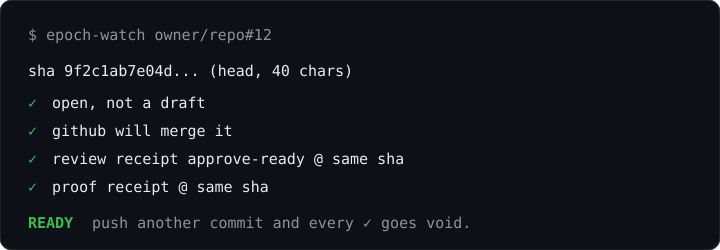

# epoch

**epoch is your unattended software engineer. it is the engineering workflow running inside an aeon instance.**

give it a goal and a codebase. it takes the work from spec to build, review, proof and a verdict on whether the pr is ready to merge. it reads the repo, plans the change, writes the code, runs the checks, reviews its own diff, fixes what fails in one bounded pass, and shows evidence that the change works.

it doesn't stop at generating code. it can pick up existing work, see what already happened, continue where it stopped, and carry a change to a verified result.

you stay in control. you define what needs to happen. epoch does the engineering, and you press merge.

<p align="center"></p>

your codebase. your aeon. your engineer.

## the loop

```
spec ─▶ build ─▶ review ─▶ prove ─▶ watch ─▶ ship
```

| stage | what happens | skill |
|---|---|---|
| spec | understand the task, the repo, the constraints and the expected outcome. one small work order per unit | `epoch-spec` |
| build | implement the order in a throwaway checkout, run its verify commands, open one pr | `epoch-build` |
| review | inspect the diff at a pinned sha, re-run the pr's own claims, make one bounded repair if needed | `epoch-review`, `epoch-build` |
| prove | run the change and capture evidence at the same sha | `create-prove` (ships with aeon) |
| watch | check the four ready conditions and say which one failed | `epoch-watch` |
| ship | merge. this one is yours | you |

everything runs through your aeon instance, with its skills, tools, memory, permissions and github actions. nothing to install on your machine.

## the point: receipts, not vibes

a model saying "looks good" is not evidence. so review and proof are **receipts**: a one-line marker in a github comment, bound to one 40-char head sha.

```
<!-- aeon-review:{"schema":1,"target":"owner/repo#12","sha":"<40 hex>","verdict":"approve-ready","critical":0,"issues":0} -->
```

`scripts/dev-loop-review.sh` and `scripts/dev-loop-proof.sh` (both already in aeon) re-derive the verdict from github at that sha. nothing is read from a file a skill wrote locally. push another commit and the sha changes, so both receipts are void until the new head is reviewed and proven again.

`epoch-watch` calls a pr ready only when four things hold at the same sha:

1. the pr is open and not a draft
2. github is willing to merge it
3. a review receipt exists and the verdict isn't `blocked`
4. a proof receipt exists

github saying "mergeable" is one condition of four, not the answer. it can say yes while the review and proof receipts are missing, and then the pr is not ready.

## what you need

- an aeon instance recent enough to have `scripts/dev-loop-review.sh`, `scripts/dev-loop-proof.sh` and the `create-prove` skill. a fork made through [aeon connect](https://www.aeon.fun/connect) works.
- `GH_GLOBAL`: a github token that can read the repos you point it at, push branches and write pull requests there. for `epoch-build` and `epoch-review`.
- whatever model credential your instance already uses.
- nothing to install on your own machine. it runs on your github actions.

## install

```
bin/install-skill-pack Svector-anu/aeon-epoch-pack
```

skills land disabled and run only when dispatched. enable nothing you don't want running.

## try it

```
./aeon skills run epoch-spec   --var "fix the flaky retry test in the sync job"
./aeon skills run epoch-build  --var "order:memory/topics/<project>/orders/<id>.md"
./aeon skills run epoch-review --var "<owner>/<repo>#<n>"
./aeon skills run create-prove --var "<owner>/<repo>#<n>@<40-char-sha>"
./aeon skills run epoch-watch  --var "<owner>/<repo>#<n>"
```

each skill's `var` is documented at the top of its `SKILL.md`. if you leave `epoch-review` or `epoch-watch` empty they read the pointer `epoch-build` left behind, and only to learn which pr and which sha.

## limits, said plainly

- **every stage is dispatched by hand.** nothing chains them. you can wire a chain in `aeon.yml` if you want one.
- **proof is narrow.** `create-prove` handles prs that change exactly one runnable skill, by running it through the repo's real workflow. any other shape fails closed with no receipt, so that pr can't reach ready.
- **repair is one pass.** if review is still actionable after it, that's a terminal result for the order, not a reason to loop.
- **same-family review is weaker.** if build and review ran on the same model family, the review says so. a fresh context is the independence you get, so don't read more into it.
- **nothing merges itself.** not `epoch-watch`, not anything else here.
- **status:** the loop has run end to end on a real instance. this packaging is new and hasn't been installed on a fresh aeon yet, so expect rough edges. questions or something broke? write to anu@aeon.fun.

## tuning it

the agent is files you own. the skills are prompts in `skills/*/SKILL.md`: edit them in your own repo. `STRATEGY.md` steers what `epoch-spec` thinks is worth doing. keep the receipt format and the gate calls as they are, since those are what make the receipts checkable.

## contact

more info: anu@aeon.fun

## license

mit.
